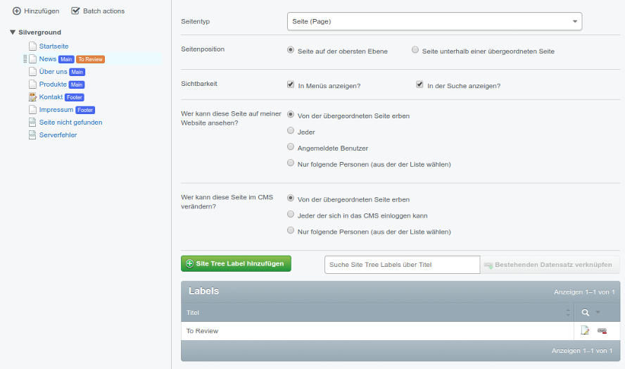

# SiteTree Labeling
[](https://travis-ci.org/JZubero/silverstripe-sitetree-labels)


Help to enrich your big and messy SiteTrees with some extra top-level information using labels.

Besides your custom labels the module will look for the [Menu Manager](https://github.com/heyday/silverstripe-menumanager) and auto-assign the MenuSet names to the Pages.

## Install
`composer require jzubero/silverstripe-sitetree-labels`

Do not forget to `dev/build?flush=all`.

## Dependencies
- silverstripe/cms:^3.2
- ryanpotter/silverstripe-color-field:^0.1.0

## Features
- GridField in Settings for adding and linking labels
- Integration for Menu Manager Module
- Report for looking up pages linked to a certain label

## Configuration
You can adjust the modules' behaviour through the Config API.

```yml
SiteTree:
  show_labels: true|false
SiteTreeLabel:
  label_color: '#426ef4' # Default label color
  show_menu_labels: true|false # Flag for menu labels generated by HeyDay's Menu Manager Module (if available)
```

## Customization
If you want to change the label look you can apply your custom style definitions to the class `.sitetree-label`. Default style:

```css
.sitetree-label {
    border-radius: 3px;
    font-size: 0.75rem;
    padding: 2px 4px;
    color: #fff;
    text-shadow: none;
}
```

## Extending
You can add extra labels via code by using the `updateSiteTreeLabels` hook method.

```php
public function updateSiteTreeLabels(ArrayList &$labels) {
    $labels->add([
        'Title': 'My Custom Label',
        'Color': '#ed135a'
    ]);
}
```

## Thanks... :clap:
- ...**wmk** for contributing to this module.
- ...**Andreas Spannbauer, Eric Hes** and **Zauberfisch** for discussing the module idea with me at StripeConEU 2017.

## Maintainer
- JZubero <js@lvl51.de>